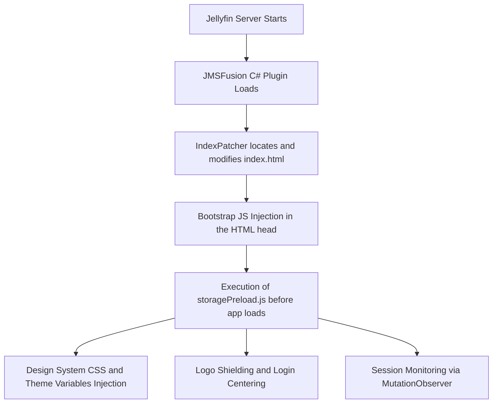
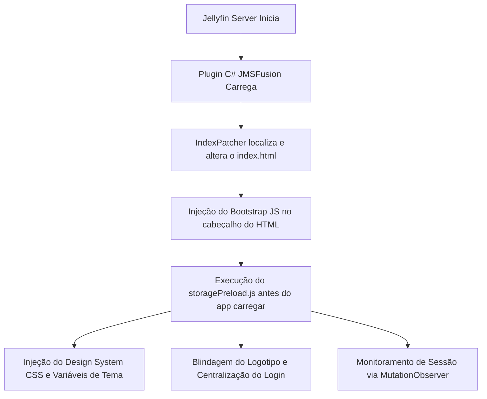

> [!NOTE]
> **Versão em Português disponível no final do documento.** / **Portuguese version available at the end of this document.**
> Para ler em português, role até o final da página ou clique [aqui](#nexus-pobreflix-plugin-jellyfin-edition-portugues).
> 
> *To read in Portuguese, scroll to the bottom or click [here](#nexus-pobreflix-plugin-jellyfin-edition-portugues).*

<div align="center">
  


  # Nexus PobreFlix Plugin (Jellyfin Edition)

  **The ultimate visual and industrial experience for your Jellyfin server — 100% PT-BR and Nexus Purple Theme.**

  
  
  
  
</div>

---

## 📖 About the Project and Origin

The **Nexus PobreFlix** is the official visual engine of the PobreFlix ecosystem for Jellyfin servers. 

This project is a **high-performance fork of the original JMSFusion plugin**, originally developed by **G-Grbz**. The **Nexus PobreFlix** edition, maintained and extended by **ONeithan**, was rebuilt with the goal of offering a premium, cinema-level visual experience ("Netflix" style), with a complete rebrand to the purple theme, severe rendering performance optimizations, smart media controls, and absolute Brazilian Portuguese translation.

---

## 🎓 How does the Plugin work? (Technical Architecture)

To inject modifications without breaking or degrading the Jellyfin server, the plugin operates through a hybrid architecture of C# injection (Backend) and Javascript/CSS (Frontend):



### 1. Hybrid Injection (`IndexPatcher.cs`)
The plugin's backend in C# monitors Jellyfin's startup and locates the physical `index.html` file of the web client. It surgically injects a script tag pointing to our local bootstrap. This ensures that the purple theme styles and custom splash screen are loaded immediately, preventing the "flash effect" of Jellyfin's original white/blue layout.

### 2. Login Lifecycle (`storagePreload.js`)
The preloading script monitors Jellyfin's authentication state reactively using an ultra-lightweight and surgical `MutationObserver` directed at the `#loginPage` element. 
- **Logged out**: Applies the `jms-logged-out` class to the `body`, hiding the navigation bar (`.skinHeader`) and applying the centralized login layout with an immersive background.
- **Logged in**: Removes the `jms-logged-out` class, restoring the header and displaying the shielded purple logo.

### 3. Offline Autonomy
All images (including the logo and icons) are served locally through Embedded Resources compiled inside the plugin's DLL and exposed by a local ASP.NET Core controller (`JMSFusionAssetsController.cs`). This eliminates dependencies on external CDNs, allowing the interface to function completely on local networks without internet access.

---

## ✨ Premium Features and Key Differentiators

### 🟣 Nexus Purple Design System
The entire administrative configuration interface of the plugin and the visual components of the web client have been redesigned. The original palette was replaced with **Nexus Purple (`#7a5cff`)**, providing a high-standard aesthetic uniformity in sliders, buttons, details modals, and progress bars.

### 🔒 Shielded and Centralized Login
The login panel has been absolutely centered on both desktop and mobile. Additionally, we created specific CSS rules so that residual floating elements of the login page disappear instantly after successful authentication.

### 🛡️ PobreFlix Logo with Supreme Shielding
To guarantee the permanent display of the PobreFlix logo, we applied a CSS rule with 6 levels of specificity on the brand selector. This neutralizes layout inhibitions (`display: none !important`) inherited from other themes installed on the client, hiding Jellyfin's native SVGs and drawing the purple logo in their place.

### 📜 Free Header (Not Fixed)
To increase immersion and free up useful screen space during navigation, the top bar (`.skinHeader`) was reconfigured with absolute positioning. When scrolling down, the header naturally scrolls up with the page, instead of remaining locked at the top of the screen.

### 🔊 Smart Trailer Manager
YouTube trailers and local HTML5 players have been attenuated:
- **Default Volume**: Limited to **5%** to protect users' ears.
- **Hover Attenuation**: The volume automatically drops to **1%** when hovering over the active trailer card, returning to 5% when the cursor is removed.

### 🇧🇷 Absolute PT-BR Localization
Deep linguistic audit of all 2,000+ translation keys. The avatar selection menu, the administrative database panel, and the media players are 100% translated, eliminating residual terms in Turkish and English.

---

## 🛠️ Installation and Deployment Instructions

### Method 1: Adding the Repository (Recommended)
To receive automatic plugin updates directly in your Jellyfin dashboard:
1. Access your Jellyfin administration dashboard.
2. Go to **Plugins → Repositories** and click **Add**.
3. Add the following link to the **URL** field:

```text
https://raw.githubusercontent.com/ONeithan/Nexus-PobreFlix/main/manifest.json
```

4. Set the name to `Nexus PobreFlix Repository`, save, and install the plugin from the **Catalog**.

### Method 2: Manual Installation
1. Download the ZIP file of the stable version `NexusPobreFlix-1.0.0.0.zip` from the Releases tab.
2. Access your Jellyfin server folder and locate the `plugins` directory (on Windows, it is located at `%ProgramData%/Jellyfin/Server/plugins`).
3. Create a subfolder named `NexusPobreFlix`.
4. Extract the DLL and `meta.json` from the zip into this folder.
5. Restart the Jellyfin server.
6. Clear your browser cache (Ctrl + F5) on the client to view the changes.

---

## 📂 Code Directory Structure

For development and maintenance purposes, the repository is organized as follows:
```
Nexus-PobreFlix/
├── bin/Release/net9.0/      # Compiled binaries
├── Controllers/            # API routes and local resource server
├── Core/                   # C# logic (trailer automation and runtime hooks)
├── img/                    # Graphic assets of the repository (logo and icon)
├── Properties/             # Build definitions
├── Resources/
│   └── slider/             # Slider and player scripts and files
│       ├── main.js         # Core JS for layout injection
│       └── src/            # Stylesheets (CSS)
├── RuntimeModules/         # Scripts executed during bootstrap (storagePreload.js, splash.js)
├── Web/                    # HTML page for administrative configuration
├── JMSFusion.csproj        # MSBuild project definition file
├── manifest.json           # Auto-update manifest
└── meta.json               # Plugin metadata for the catalog
```

---

## 📜 Licensing and Authorship

- **Base Code (JMSFusion)**: Developed by [G-Grbz](https://github.com/G-Grbz) under the MIT License.
- **Edition and Fork (Nexus PobreFlix)**: Visual customizations, PT-BR localization, and rebranding maintained by [ONeithan](https://github.com/ONeithan).

---

<div align="center">
  <br/>
  
  <br/>
  <sub>Developed with 💜 for the Nexus PobreFlix community</sub>
</div>

---

<div id="nexus-pobreflix-plugin-jellyfin-edition-portugues"></div>

# Nexus PobreFlix Plugin (Jellyfin Edition) - Versão em Português

<div align="center">
  


  **A experiência visual definitiva e industrial para seu servidor Jellyfin — 100% PT-BR e Tema Roxo Nexus.**

  
  
  
  
</div>

---

## 📖 Sobre o Projeto e Origem

O **Nexus PobreFlix** é o motor visual oficial do ecossistema PobreFlix para servidores Jellyfin. 

Este projeto é um **fork de alto desempenho do plugin original JMSFusion**, desenvolvido originalmente por **G-Grbz**. A edição **Nexus PobreFlix**, mantida e estendida por **ONeithan**, foi reconstruída com o objetivo de oferecer uma experiência visual premium de nível cinematográfico (estilo "Netflix"), com rebrand completo para o tema roxo, otimizações severas de performance de renderização, controle inteligente de mídia e tradução PT-BR absoluta.

---

## 🎓 Como o Plugin Funciona? (Arquitetura Técnica)

Para injetar as modificações sem quebrar ou degradar o servidor Jellyfin, o plugin opera através de uma arquitetura híbrida de injeção em C# (Backend) e Javascript/CSS (Frontend):



### 1. Injeção Híbrida (`IndexPatcher.cs`)
O backend do plugin em C# monitora a inicialização do Jellyfin e localiza o arquivo físico `index.html` do cliente web. Ele injeta de forma cirúrgica uma tag de script apontando para o nosso bootstrap local. Isso garante que os estilos do tema roxo e a tela de splash customizada sejam carregados imediatamente, impedindo o "efeito flash" do layout branco/azul original do Jellyfin.

### 2. Ciclo de Vida do Login (`storagePreload.js`)
O script de pré-carregamento monitora o estado de autenticação do Jellyfin de forma reativa através de um `MutationObserver` ultra-leve e cirúrgico direcionado ao elemento `#loginPage`. 
- **Deslogado**: Aplica a classe `jms-logged-out` ao `body`, ocultando a barra de navegação (`.skinHeader`) e aplicando o layout de login centralizado com fundo imersivo.
- **Logado**: Remove a classe `jms-logged-out`, restaurando o cabeçalho e exibindo a logo roxa blindada.

### 3. Autonomia Offline
Todas as imagens (incluindo o logotipo e ícones) são servidas localmente através de recursos embutidos (Embedded Resources) compilados dentro da DLL do plugin e expostos por um controller ASP.NET Core local (`JMSFusionAssetsController.cs`). Isso elimina dependências de CDNs externos, permitindo o funcionamento completo da interface em redes locais sem acesso à internet.

---

## ✨ Recursos e Diferenciais Premium

### 🟣 Design System Roxo Nexus
Toda a interface de configuração administrativa do plugin e os componentes visuais do cliente web foram remodelados. A paleta original foi substituída pelo **Roxo Nexus (`#7a5cff`)**, proporcionando uniformidade estética de alto padrão em sliders, botões, modais de detalhes e barras de progresso.

### 🔒 Login Blindado e Centralizado
O painel de login foi centralizado de forma absoluta no desktop e mobile. Além disso, criamos regras CSS específicas para que elementos flutuantes residuais da página de login desapareçam instantaneamente após a autenticação bem-sucedida.

### 🛡️ Logotipo PobreFlix com Blindagem Suprema
Para garantir a exibição permanente do logotipo do PobreFlix, aplicamos uma regra CSS com 6 níveis de especificidade no seletor de marca. Isso neutraliza inibições de layout (`display: none !important`) herdadas de outros temas instalados no cliente, ocultando os SVGs nativos do Jellyfin e desenhando a logo roxa em seu lugar.

### 📜 Cabeçalho Livre (Não Fixo)
Para aumentar a imersão e liberar espaço útil de exibição na tela durante a navegação, a barra superior (`.skinHeader`) foi reconfigurada com posicionamento absoluto. Ao rolar a página para baixo, o cabeçalho sobe junto com o scroll de forma natural, ao invés de ficar travado no topo da tela.

### 🔊 Gerenciador Inteligente de Trailers
Os trailers do YouTube e reprodutores HTML5 locais foram atenuados:
- **Volume Padrão**: Limitado a **5%** para proteger os ouvidos dos usuários.
- **Atenuação no Hover**: O volume cai automaticamente para **1%** ao passar o mouse sobre o card de trailer em reprodução, retornando para 5% ao retirar o cursor.

### 🇧🇷 Localização PT-BR Absoluta
Auditoria linguística profunda de todas as mais de 2.000 chaves de tradução. O menu de alteração de avatares, o painel administrativo de banco de dados e os reprodutores de mídia estão 100% traduzidos, eliminando termos residuais em turco e inglês.

---

## 🛠️ Instruções de Instalação e Deploy

### Método 1: Adição de Repositório (Recomendado)
Para receber atualizações automáticas do plugin diretamente no seu painel do Jellyfin:
1. Acesse o painel de administração do seu Jellyfin.
2. Vá em **Plugins → Repositórios** e clique em **Adicionar**.
3. Adicione o seguinte link no campo **URL**:

```text
https://raw.githubusercontent.com/ONeithan/Nexus-PobreFlix/main/manifest.json
```

4. Defina o nome como `Repositório Nexus PobreFlix`, salve e faça a instalação do plugin em **Catálogo**.

### Método 2: Instalação Manual
1. Baixe o arquivo ZIP da versão estável `NexusPobreFlix-1.0.0.0.zip` na aba de Releases.
2. Acesse a pasta do seu servidor Jellyfin e localize o diretório `plugins` (no Windows fica em `%ProgramData%/Jellyfin/Server/plugins`).
3. Crie uma subpasta chamada `NexusPobreFlix`.
4. Extraia o conteúdo da DLL e do `meta.json` do zip dentro desta pasta.
5. Reinicie o servidor Jellyfin.
6. Limpe o cache do seu navegador (Ctrl + F5) no cliente para visualizar as alterações.

---

## 📂 Estrutura de Diretórios do Código

Para fins de desenvolvimento e manutenção, o repositório está organizado da seguinte forma:
```
Nexus-PobreFlix/
├── bin/Release/net9.0/      # Binários compilados
├── Controllers/            # Rotas API e Servidor de Recursos locais
├── Core/                   # Lógica C# (automação de trailers e hooks de runtime)
├── img/                    # Ativos gráficos do repositório (logo e ícone)
├── Properties/             # Definições de compilação
├── Resources/
│   └── slider/             # Scripts e arquivos do reprodutor e slider
│       ├── main.js         # Core JS de injeção de layouts
│       └── src/            # Folhas de estilo (CSS)
├── RuntimeModules/         # Scripts executados no bootstrap (storagePreload.js, splash.js)
├── Web/                    # Página HTML de configuração administrativa
├── JMSFusion.csproj        # Arquivo de definição do projeto MSBuild
├── manifest.json           # Manifesto de auto-update
└── meta.json               # Metadados do plugin para o catálogo
```

---

## 📜 Licenciamento e Autoria

- **Código Base (JMSFusion)**: Desenvolvido por [G-Grbz](https://github.com/G-Grbz) sob Licença MIT.
- **Edição e Fork (Nexus PobreFlix)**: Customizações visuais, localização PT-BR e rebrand mantidos por [ONeithan](https://github.com/ONeithan).

---

<div align="center">
  <br/>
  
  <br/>
  <sub>Desenvolvido com 💜 para a comunidade Nexus PobreFlix</sub>
</div>
