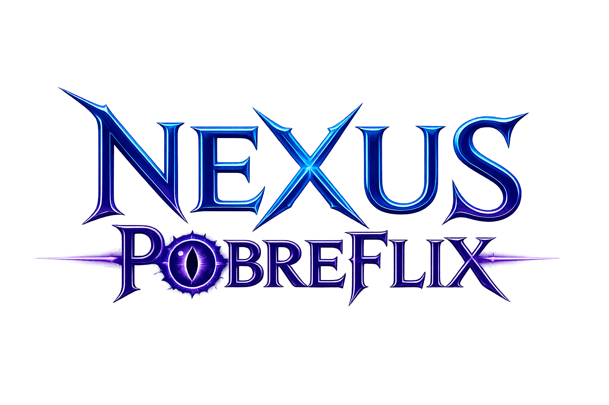

<div align="center">
  

  # Nexus PobreFlix Plugin

  **O motor visual definitivo do Nexus PobreFlix para Jellyfin — Otimizado e em PT-BR.**

  
  
  
  
</div>

---

> ℹ️ **Note for English Speakers:** The English documentation is available at the [bottom of this page](#english).

---

## 🇧🇷 Português (Brasil)

### 🚀 O que é o Nexus PobreFlix Plugin?
Este é um fork personalizado e de **Grau Industrial** do plugin MonWUI, desenvolvido exclusivamente para o ecossistema **Nexus PobreFlix**. Esta versão foi reconstruída para oferecer máxima performance, estabilidade em sessões de usuário e uma interface 100% traduzida nativamente.

### ✨ Diferenciais da Versão Industrial (v0.0.1)
| Funcionalidade | Descrição |
|---|---|
| 🇧🇷 **Tradução Industrial** | Toda a interface (Slider, Studio Hubs, Seletor de Perfil) traduzida no core. Sem atrasos de scripts externos. |
| 👤 **Seletor de Perfil Otimizado** | Sistema de troca de perfis ultra-rápido, assíncrono e com persistência de sessão aprimorada. |
| 🎬 **Studio Hubs Premium** | Coleções de estúdios com trailers automatizados, controle de volume configurável e interface limpa. |
| 🖥️ **Full Screen Imersivo** | Removidas as travas de layout para uma experiência cinematográfica real em qualquer resolução. |
| ⚡ **Limpidez Industrial** | Código otimizado, remoção de bugs visuais e CSS de alto desempenho. |

### 🛠️ Como Instalar (Manual)
1. Baixe o arquivo `NexusPobreFlix.dll` mais recente na aba [Releases](../../releases).
2. Acesse a pasta de plugins do seu servidor Jellyfin (geralmente `/config/plugins/`).
3. Substitua a DLL original (se houver) pela nossa versão.
4. Reinicie o Jellyfin e faça um **Hard Refresh** (`Ctrl + F5`) no seu navegador.

### 📦 Instalação via Repositório (Recomendado)
Para receber atualizações automáticas e instalar pelo catálogo do Jellyfin, adicione este link em **Painel → Plugins → Repositórios**:

```
https://raw.githubusercontent.com/ONeithan/Nexus-PobreFlix/refs/heads/main/manifest.json
```

---

<a name="english"></a>
## 🇺🇸 English

### 🚀 What is Nexus PobreFlix Plugin?
This is a custom, **Industrial-Grade** fork of the MonWUI plugin, built for the **Nexus PobreFlix** media server. It delivers a performance-optimized, fully localized experience with removed layout restrictions and enhanced session stability.

### ✨ Key Industrial Features (v0.0.1)
- **Native PT-BR Core:** Fully localized interface without external script overhead.
- **Optimized Profile Chooser:** Faster, non-blocking asynchronous user switching.
- **Premium Studio Hubs:** Configurable trailer volume and clean metadata rendering.
- **Immersive Full Screen:** True cinematic layout without standard width locks.
- **Industrial Cleanliness:** Optimized CSS and zero-pollution DOM architecture.

### 🛠️ Manual Installation
1. Download the latest `NexusPobreFlix.dll` from the [Releases](../../releases) page.
2. Replace the original DLL in your Jellyfin server's plugin folder.
3. Restart Jellyfin and perform a **Hard Refresh** (`Ctrl + F5`).

### 📦 Repository Installation
Add the following URL to your Jellyfin server (**Dashboard → Plugins → Repositories**):
```
https://raw.githubusercontent.com/ONeithan/Nexus-PobreFlix/refs/heads/main/manifest.json
```

---

## 🛡️ Créditos e Licença / Credits and License

Este software é um fork personalizado e de grau industrial do projeto MonWUI.
Todos os direitos da versão original pertencem ao seu autor original.

- **Motor original / Original Engine:** [G-grbz/Jellyfin-MonWUI-Plugin](https://github.com/G-grbz/Jellyfin-MonWUI-Plugin) (Créditos totais ao criador original).
- **Desenvolvimento e Industrialização Nexus:** [Nexus PobreFlix](https://github.com/ONeithan) — Nexus IA.

Este fork é distribuído sob a mesma Licença MIT do projeto original, com as modificações e personalizações exclusivas da equipe Nexus PobreFlix, mantendo a compatibilidade e o respeito ao trabalho base.

---

<div align="center">
  
  <br/>
  <sub>Desenvolvido com 💜 para a comunidade Nexus PobreFlix</sub>
</div>
