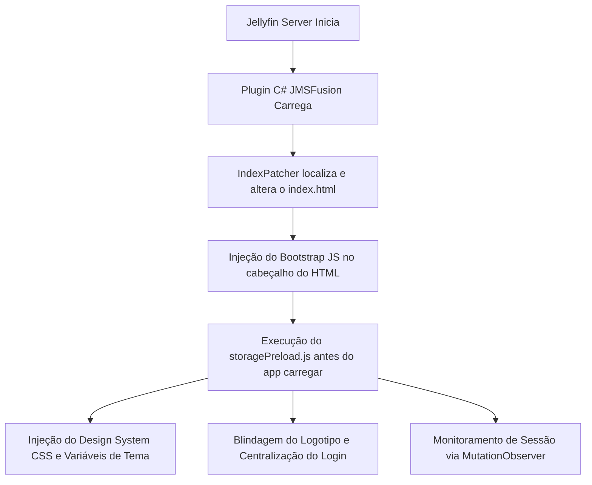

<div align="center">
  


  # Nexus PobreFlix Plugin (Jellyfin Edition)

  **A experiência visual definitiva e industrial para seu servidor Jellyfin — 100% PT-BR e Tema Roxo Nexus.**

  
  
  
  
</div>

---

## 📖 Sobre o Projeto e Origem

O **Nexus PobreFlix** é o motor visual oficial do ecossistema PobreFlix para servidores Jellyfin. 

Este projeto é um **fork de alto desempenho do plugin original JMSFusion**, desenvolvido originalmente por **G-Grbz**. A edição **Nexus PobreFlix**, mantida e estendida por **ONeithan**, foi reconstruída com o objetivo de oferecer uma experiência visual premium de nível cinematográfico (estilo "Netflix"), com rebrand completo para o tema roxo, otimizações severas de performance de renderização, controle inteligente de mídia e tradução PT-BR absoluta.

---

## 🎓 Como o Plugin Funciona? (Arquitetura Técnica)

Para injetar as modificações sem quebrar ou degradar o servidor Jellyfin, o plugin opera através de uma arquitetura híbrida de injeção em C# (Backend) e Javascript/CSS (Frontend):



### 1. Injeção Híbrida (`IndexPatcher.cs`)
O backend do plugin em C# monitora a inicialização do Jellyfin e localiza o arquivo físico `index.html` do cliente web. Ele injeta de forma cirúrgica uma tag de script apontando para o nosso bootstrap local. Isso garante que os estilos do tema roxo e a tela de splash customizada sejam carregados imediatamente, impedindo o "efeito flash" do layout branco/azul original do Jellyfin.

### 2. Ciclo de Vida do Login (`storagePreload.js`)
O script de pré-carregamento monitora o estado de autenticação do Jellyfin de forma reativa através de um `MutationObserver` ultra-leve e cirúrgico direcionado ao elemento `#loginPage`. 
- **Deslogado**: Aplica a classe `jms-logged-out` ao `body`, ocultando a barra de navegação (`.skinHeader`) e aplicando o layout de login centralizado com fundo imersivo.
- **Logado**: Remove a classe `jms-logged-out`, restaurando o cabeçalho e exibindo a logo roxa blindada.

### 3. Autonomia Offline
Todas as imagens (incluindo o logotipo e ícones) são servidas localmente através de recursos embutidos (Embedded Resources) compilados dentro da DLL do plugin e expostos por um controller ASP.NET Core local (`JMSFusionAssetsController.cs`). Isso elimina dependências de CDNs externos, permitindo o funcionamento completo da interface em redes locais sem acesso à internet.

---

## ✨ Recursos e Diferenciais Premium

### 🟣 Design System Roxo Nexus
Toda a interface de configuração administrativa do plugin e os componentes visuais do cliente web foram remodelados. A paleta original foi substituída pelo **Roxo Nexus (`#7a5cff`)**, proporcionando uniformidade estética de alto padrão em sliders, botões, modais de detalhes e barras de progresso.

### 🔒 Login Blindado e Centralizado
O painel de login foi centralizado de forma absoluta no desktop e mobile. Além disso, criamos regras CSS específicas para que elementos flutuantes residuais da página de login desapareçam instantaneamente após a autenticação bem-sucedida.

### 🛡️ Logotipo PobreFlix com Blindagem Suprema
Para garantir a exibição permanente do logotipo do PobreFlix, aplicamos uma regra CSS com 6 níveis de especificidade no seletor de marca. Isso neutraliza inibições de layout (`display: none !important`) herdadas de outros temas instalados no cliente, ocultando os SVGs nativos do Jellyfin e desenhando a logo roxa em seu lugar.

### 📜 Cabeçalho Livre (Não Fixo)
Para aumentar a imersão e liberar espaço útil de exibição na tela durante a navegação, a barra superior (`.skinHeader`) foi reconfigurada com posicionamento absoluto. Ao rolar a página para baixo, o cabeçalho sobe junto com o scroll de forma natural, ao invés de ficar travado no topo da tela.

### 🔊 Gerenciador Inteligente de Trailers
Os trailers do YouTube e reprodutores HTML5 locais foram atenuados:
- **Volume Padrão**: Limitado a **5%** para proteger os ouvidos dos usuários.
- **Atenuação no Hover**: O volume cai automaticamente para **1%** ao passar o mouse sobre o card de trailer em reprodução, retornando para 5% ao retirar o cursor.

### 🇧🇷 Localização PT-BR Absoluta
Auditoria linguística profunda de todas as mais de 2.000 chaves de tradução. O menu de alteração de avatares, o painel administrativo de banco de dados e os reprodutores de mídia estão 100% traduzidos, eliminando termos residuais em turco e inglês.

---

## 🛠️ Instruções de Instalação e Deploy

### Método 1: Adição de Repositório (Recomendado)
Para receber atualizações automáticas do plugin diretamente no seu painel do Jellyfin:
1. Acesse o painel de administração do seu Jellyfin.
2. Vá em **Plugins → Repositórios** e clique em Adicionar.
3. Insira as seguintes informações:
   - **Nome**: Repositório Nexus PobreFlix
   - **URL**: `https://raw.githubusercontent.com/ONeithan/Nexus-PobreFlix/main/manifest.json`
4. Salve e instale o plugin em **Catálogo**.

### Método 2: Instalação Manual
1. Baixe o arquivo ZIP da versão estável `NexusPobreFlix-1.0.0.0.zip` na aba de Releases.
2. Acesse a pasta do seu servidor Jellyfin e localize o diretório `plugins` (no Windows fica em `%ProgramData%/Jellyfin/Server/plugins`).
3. Crie uma subpasta chamada `NexusPobreFlix`.
4. Extraia o conteúdo da DLL e do `meta.json` do zip dentro desta pasta.
5. Reinicie o servidor Jellyfin.
6. Limpe o cache do seu navegador (Ctrl + F5) no cliente para visualizar as alterações.

---

## 📂 Estrutura de Diretórios do Código

Para fins de desenvolvimento e manutenção, o repositório está organizado da seguinte forma:
```
Nexus-PobreFlix/
├── bin/Release/net9.0/      # Binários compilados
├── Controllers/            # Rotas API e Servidor de Recursos locais
├── Core/                   # Lógica C# (automação de trailers e hooks de runtime)
├── img/                    # Ativos gráficos do repositório (logo e ícone)
├── Properties/             # Definições de compilação
├── Resources/
│   └── slider/             # Scripts e arquivos do reprodutor e slider
│       ├── main.js         # Core JS de injeção de layouts
│       └── src/            # Folhas de estilo (CSS)
├── RuntimeModules/         # Scripts executados no bootstrap (storagePreload.js, splash.js)
├── Web/                    # Página HTML de configuração administrativa
├── JMSFusion.csproj        # Arquivo de definição do projeto MSBuild
├── manifest.json           # Manifesto de auto-update
└── meta.json               # Metadados do plugin para o catálogo
```

---

## 📜 Licenciamento e Autoria

- **Código Base (JMSFusion)**: Desenvolvido por [G-Grbz](https://github.com/G-Grbz) sob Licença MIT.
- **Edição e Fork (Nexus PobreFlix)**: Customizações visuais, localização PT-BR e rebrand mantidos por [ONeithan](https://github.com/ONeithan).

---

<div align="center">
  <br/>
  
  <br/>
  <sub>Desenvolvido com 💜 para a comunidade Nexus PobreFlix</sub>
</div>
